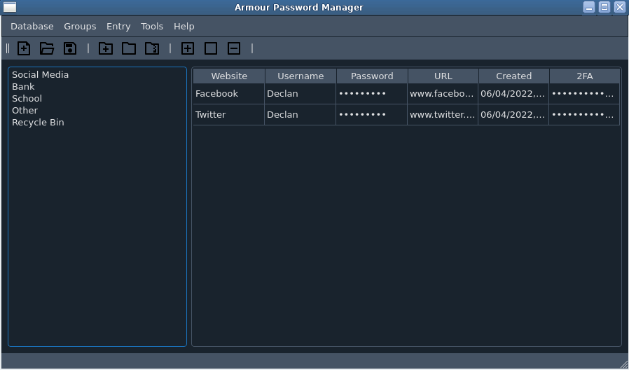

# Armour - Password Manager
****
Icon set used: https://remixicon.com/
****

****
## About
Armour is a secure password manager created as a final year project for Computer Science.

## Run Armour
This program was developed and tested on Python3.9.
- Linux
```commandline
# Create virtual environment.
python3.9 -m venv ArmourVenv

# Activate it.
source ArmourVenv/bin/activate

# Install required packages.
pip install pyAesCrypt==6.0.0 PyQt5==5.15.4 zxcvbn==4.4.28 pyotp==2.6.0 qdarkstyle==3.0.3

# Move to src directory.
cd src

# Run program.
python3.9 main.py
```
- Windows
```commandline
# Create virtual environment.
python -m venv ArmourVenv

# Activate it.
ArmourVenv\Scripts\activate.bat

# Install required packages.
pip install pyAesCrypt==6.0.0 PyQt5==5.15.4 zxcvbn==4.4.28 pyotp==2.6.0 qdarkstyle==3.0.3

# Move to src directory.
cd src

# Run program.
python main.py
```

